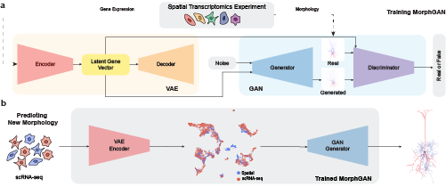

# MorphNet Predicts Cell Morphology from Single-Cell Gene Expression



[Paper](https://www.biorxiv.org/content/10.1101/2022.10.21.513201v1) | [Code](https://github.com/single-cell-morphology) | [Demo](https://morphnet2d.streamlit.app/)

This repository contains the training code for the paper [MorphNet: Predicting Cell Morphology from Single-Cell Gene Expression](https://www.biorxiv.org/content/10.1101/2022.10.21.513201v1). For demo, please check out our [Streamlit app](https://morphnet2d.streamlit.app/).

<!--
How to pull from `stylegan2-ada-pytorch` repo:

```
git fetch upstream
git merge upstream/main main
```

Tips:
1. ImageFolderDataset requires `np.uint8` (pixel values ranging from [0, 255]) datasets.
2. Check Python and GCC version
```
which python # should be using conda python
which gcc # gcc/8.2 module should be used, not /bin/gcc; if not, re-load module gcc/8.2.0
print(torch.__version__) # should be 1.7.1+cu110
```
3. Install scVI, then install torch==1.7.0 (stylegan2-ada used torch v1.7, but scVI will try to install a higher version)
4. AttributeError:
```
AttributeError: module 'torch.distributions.constraints' has no attribute '_CorrCholesky'
```
Solution: `pip install pyro-ppl==1.5.2`
From [here](https://www.gitmemory.com/issue/YosefLab/scvi-tools/985/791824847)
-->